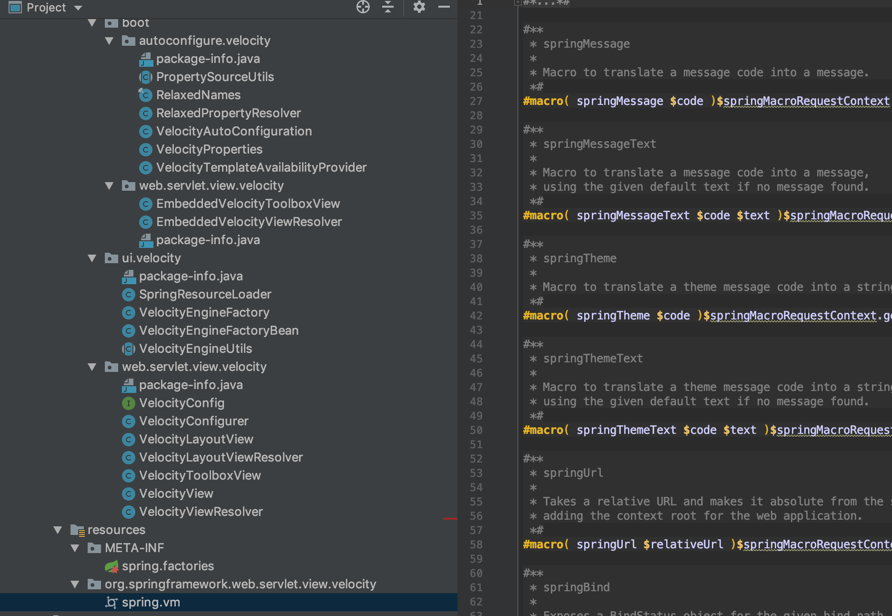

###### 背景

在springboot1.4.x版本之前对velocity的模板支持的是相当好的，不止出于什么原因springboot从1.5.x以后停止了对velocity的支持，甚至在2.x版本中移除了和velocity的相关代码。目前手上有些项目使用的是velocity模板引擎，同时也使用了springboot,现在想升级到springboot2.x,同时还想继续使用velocity,怎么办？springboot不支持，就自己想办法支持下吧。 思路：把springboot早期版本的velocity支持单独抽出一个jar。  
步骤1:  
git clone [https://github.com/spring-projects/spring-framework.git](https://github.com/spring-projects/spring-framework.git)  
切换到 4.3.2.RELEASE 版本；拷贝org.springframework.ui.velocity和org.springframework.web.servlet.view.velocity 模块下velocity的相关代码；  
步骤2:  
git clone [https://github.com/spring-projects/spring-boot.git](https://github.com/spring-projects/spring-boot.git)  
切换到v1.4.0.RELEASE；拷贝：org.springframework.boot.autoconfigure.velocity模块下 velocity的相关代码；  
由于spring5.x及springboot2.x移除了velocity相关的代码及配置，还要把spring.vm文件拷贝过来，整体代码架构如下图： 

直接编译打包

###### 接入使用:

在项目中直接添加如下依赖:

    <dependency>
        <groupId>com.ke.ehr.velocity</groupId>
        <artifactId>spring-boot-velocity-starter</artifactId>
        <version>1.0-SNAPSHOT</version>
    </dependency>
    

并添加如下配置:

    spring.velocity.charset=UTF-8  
    spring.velocity.properties.input.encoding=UTF-8  
    spring.velocity.properties.output.encoding=UTF-8  
    spring.velocity.resourceLoaderPath=classpath:/templates/  
    spring.velocity.suffix=.vm  
    spring.velocity.toolbox-config-location=/WEB-INF/toolbox.xml  
    

在spring.xml中添加视图解析配置:

    <!-- 设置视图解析工具 -->  
    <bean id="velocityViewResolver" class="org.springframework.web.servlet.view.velocity.VelocityLayoutViewResolver">
        <property name="cache" value="false"/>
        <property name="layoutUrl" value="layout/layout.vm"/>
        <property name="prefix" value="/templates/"/>
        <property name="suffix" value=".vm"/>
        <property name="exposeSpringMacroHelpers" value="true"/>
        <property name="contentType" value="text/html;charset=UTF-8"/>
        <property name="viewClass" value="org.springframework.web.servlet.view.velocity.VelocityLayoutView"/>
    </bean>
    

按照上述配置即可在springboot2.x项目中使用velocity模板，欢迎有需要的小伙伴试用，使用过程中有问题可以直接反馈给我
